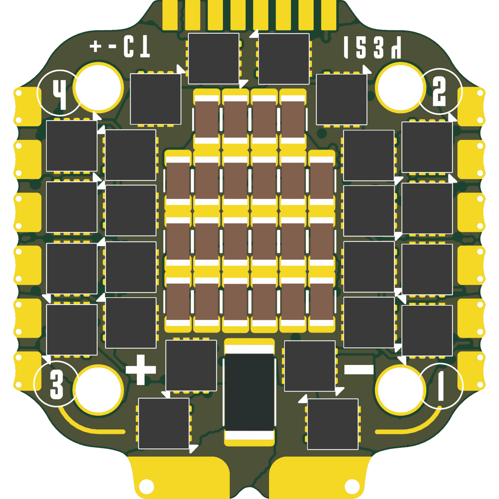
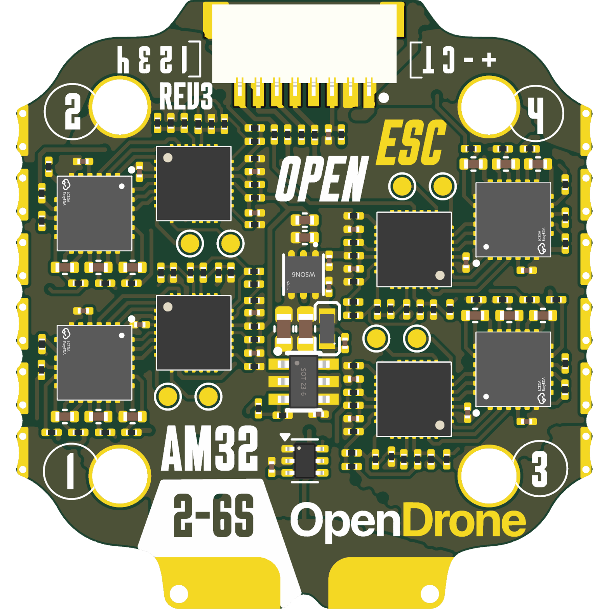

# OpenESC-20x20

Open-source 4-in-1 BLDC ESC with a 20 x 20 mm mounting pattern, part of the incutec OpenDrone line. Four independent AT32F421G8U7 motor controllers, each with an NSG2065Q gate driver and six MOSFETs, run AM32 firmware and take DShot over the standard 8-pin connector. 6S input, 6-layer PCB, designed in KiCad 10 for JLCPCB assembly. Full design detail: [hardware/docs/DESIGN.md](hardware/docs/DESIGN.md).

<p>


</p>

## Status

**Hardware validated**, Rev2-20x20, 2026-08-05.
Latest production export set is `Rev2-20x20` (2026-06-05), generated with the KiCad Fabrication Toolkit for JLCPCB assembly.

## Certification

<a href="https://certification.oshwa.org/be000028.html">
  <picture>
    <source media="(prefers-color-scheme: dark)" srcset="images/oshwa-certified-dark.svg" />
    
  </picture>
</a>

OpenESC-20x20 is **certified open source hardware** by the [Open Source Hardware Association](https://www.oshwa.org/), OSHWA UID **[BE000028](https://certification.oshwa.org/be000028.html)**.

Build video: [How Drone ESCs Work (so I built my own)](https://www.youtube.com/watch?v=TwAmmPxOpTM)

## Links

- Product page: [opendrone.be/products/openesc](https://opendrone.be/products/openesc)
- Video channel: [JustFPV on YouTube](https://www.youtube.com/@justfpv1432)

## Specifications

The full specification table (channels, input, signal protocol, firmware, PCB stackup) and part-level detail (MCU, gate driver, power stage, current sense, protection) are in [hardware/docs/DESIGN.md](hardware/docs/DESIGN.md).

## Repository layout

| Path | Contents |
|---|---|
| `hardware/` | KiCad 10 project: schematics, PCB, project-local libraries |
| `hardware/docs/` | Design documentation ([DESIGN.md](hardware/docs/DESIGN.md)) |
| `hardware/production/` | Fabrication exports (generated, gitignored) |
| `hardware/flash_openesc20.sh` | Production flash script, see [Manufacturing](#manufacturing) |
| `hardware/tools/` | Analysis scripts (`esc_thermal.py` power loss and thermal model) |
| `20x20-ESC-QC/` | Press-contact QC fixture, separate KiCad 10 project |
| `libs/KiCad-Library` | Shared Incutec symbol/footprint/3D library (git submodule) |
| `images/` | Board renders and certification marks |
| `licensing/` | Third-party asset notices, trademark policy |

## Design entry points

- Top schematic: `hardware/4in1-mini.kicad_sch` (power, current sense, connector)
- Channel schematic: `hardware/ESC.kicad_sch`, instantiated 4 times
- Board layout: `hardware/4in1-mini.kicad_pcb`, 6 copper layers
- QC fixture: `20x20-ESC-QC/20x20-ESC-QC.kicad_pro`

Symbols and footprints are embedded in the design files, so the schematics and board open without any external library. The project-local libraries are `hardware/components.kicad_sym` and `hardware/4in1ESC.pretty/`; the project lib tables also reference the shared `Incutec` library from the `libs/KiCad-Library` submodule, used for new parts. The QC fixture carries its own project-local libraries (`ESC-QC.kicad_sym`, `ESC-QC.pretty/`) and, for its contact pads, KiCad's stock `TestPoint` library, see [20x20-ESC-QC/README.md](20x20-ESC-QC/README.md).

## Build and export

```
git clone --recursive https://github.com/OpenDrone-hw/OpenESC-20x20.git
```

Open `hardware/4in1-mini.kicad_pro` in KiCad 10. Production exports (gerbers, BOM, CPL) are generated with the [KiCad Fabrication Toolkit](https://github.com/bennymeg/Fabrication-Toolkit) plugin. Headless checks and exports use `kicad-cli`:

```
kicad-cli sch erc --exit-code-violations hardware/4in1-mini.kicad_sch
kicad-cli pcb drc --exit-code-violations hardware/4in1-mini.kicad_pcb
kicad-cli pcb export gerbers -o out/ hardware/4in1-mini.kicad_pcb
```

## Manufacturing

Fabricated and assembled at JLCPCB: 6-layer, 1.69 mm board, LCSC parts. Per-revision BOM, CPL, and gerber sets are generated into `hardware/production/` (gitignored) with the Fabrication Toolkit, using the tracked `hardware/fabrication-toolkit-options.json`. Assembled boards are flashed with `hardware/flash_openesc20.sh` (AM32 bootloader via ST-LINK).

## Contributing

See [CONTRIBUTING.md](CONTRIBUTING.md).

## License

Hardware licensed under [CERN-OHL-S-2.0](https://ohwr.org/cern_ohl_s_v2.txt), covering the design files, the project-local symbols and footprints, and the manufacturing data in this repository. See [LICENSE](LICENSE), [licensing/THIRD_PARTY.md](licensing/THIRD_PARTY.md), and [licensing/TRADEMARKS.md](licensing/TRADEMARKS.md). One bundled 3D model asset carries an upstream GPL notice, see the third-party notes.

`LICENSE` stays at the repository root so GitHub detects the primary project license.
